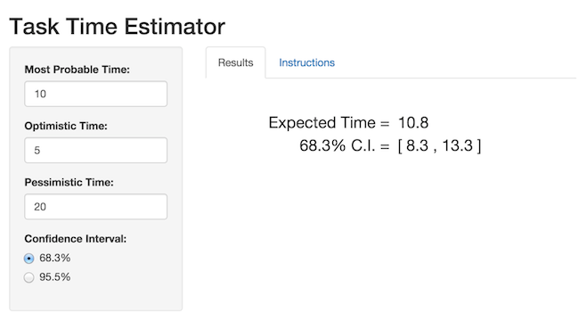

## Time Estimation in Software Development

In software project planning, developers are often asked to estimate the time
it will take to develop individual software features. However, their time
estimates are often inaccurate, resulting in missed deadlines and delayed releases.

To account for the uncertainty inherent in time estimates, many software
product managers use "three-point" estimates to construct time ranges for tasks.

These estimates are based on:

1. Most Probable Time ($latex t_m $): the most likely time estimate
2. Optimistic Time ($latex t_o $): a best-case scenario time estimate
3. Pessimistic Time ($latex t_p $): a worst-case scenario time estimate

These estimates are then used to estimate the Expected Time ($latex t_e $)
for a task and construct confidence intervals around that time.


---

## Estimating Time Ranges

Using the three estimates, a weighted average is used to calculate the Expected Time:

$$latex
t_e = \frac{t_o + 4t_m + t_p}{6}
$$

To construct a confidence interval for Expected Time, the standard deviation
is estimated as:

$$latex
\sigma = \frac{t_p - t_o}{6}
$$

Assuming a normal distribution, a 68.3% confidence interval is estimated as:

$$latex
[t_e - \sigma,\ t_e + \sigma]
$$

A 95.5% confidence interval is estimated as:

$$latex
[t_e - 2\sigma,\ t_e + 2\sigma]
$$
Reference:  
http://www.agile-code.com/blog/easy-task-estimation-with-three-point-estimation-technique/

---

## R Example

```{r}

time_o <- 5   # optimistic time
time_m <- 10  # most probable time
time_p <- 20  # pessimistic time

# expected time
time_e <- (time_o + 4*time_m + time_p) / 6

# standard deviation
sd <- (time_p - time_o) / 6 

# confidence intervals
ci_68 <- c("lower" = time_e - sd, "upper" = time_e + sd)
ci_95 <- c("lower" = time_e - 2*sd, "upper" = time_e + 2*sd)
c("68%" = ci_68, "95%" = ci_95)

```

---

## Task Time Estimation App

To simplify task estimates, I developed an app to perform these calculations automatically. The user simply enters values for Most Probable
Time, Optimistic Time, and Pessimistic Time. The app then calculates Expected
Time and provides a confidence interval based on the selected interval width
(68.3% or 95.5%). The calculations are unitless, so time values can represent
hours, days, or weeks, etc., as long all values are in the same time units.
This makes time estimation quick and easy for users. Enjoy!  



